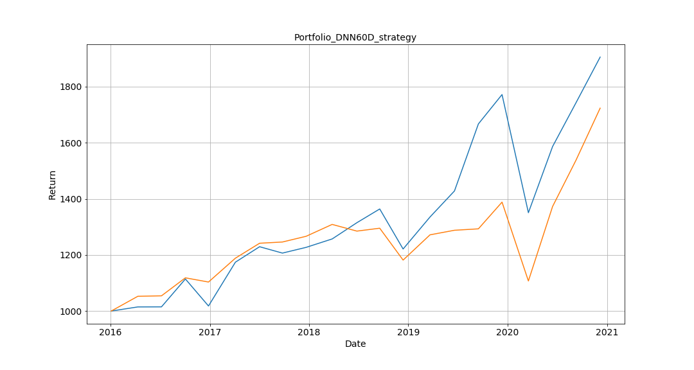

# Stock-Investment-Robot-using-NeuralNetwork-and-MeanVarianceModel

How to select stocks and invest is a big question that investors will face. Wealth management services provided by financial institutions usually have higher limits. The prevalence of Robo Advisor can provide to general public the professional wealth management and asset allocation service with low threshold.

This research uses Behavior Finance Indicators, Deep Neural Networks, and Optimization Algorithms to construct a complete Stock Robo Advisor, which includes three stages - stock selection, optimal asset allocation, and regular rebalancing in three months. The performance of this Stock Robo Advisor is presented in excel and pictures.

The model constructed through the data from 2004 to 2015. It can easily assist investors in making decisions and finding the appropriate stock allocation. For future stock selection strategies, you can continue to use this research as a reference.

The following details:

## 1. Performance
Calculate the average performance in 59 different entry times: 
##### IRR 17.5%
##### Sigma 19.8%
##### Sharpe Ratio 0.87

## 2. Model Description

## 3. Code Description

## 4. DIY Optimization

## 5. Reminder

